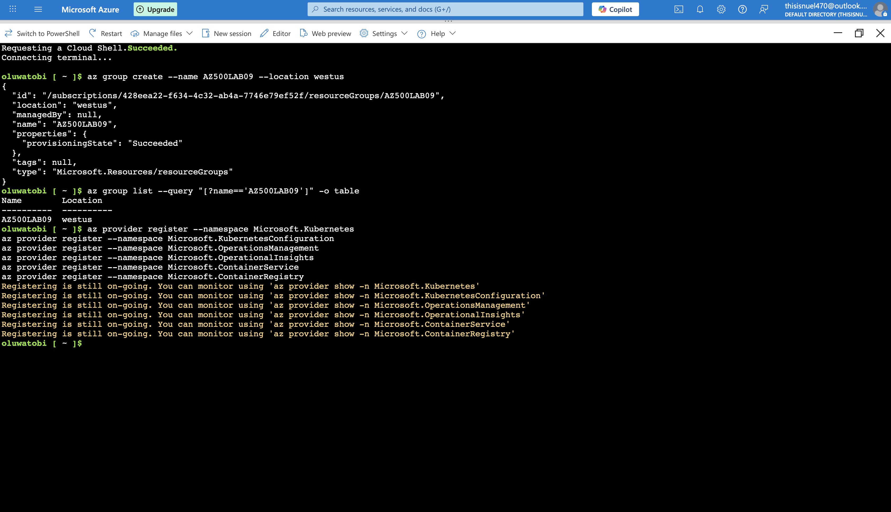
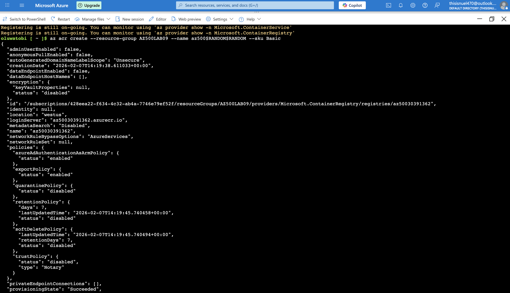

# Azure Container Registry (ACR) & Azure Kubernetes Service (AKS) Deployment and Security 

## Project Overview

This lab demonstrates the secure deployment and integration of **Azure Container Registry (ACR)** and **Azure Kubernetes Service (AKS)** in Microsoft Azure.

This Lab showcases:

- Building a container image using a Dockerfile
- Storing container images securely in Azure Container Registry
- Deploying and configuring Azure Kubernetes Service
- Granting secure access between AKS and ACR
- Deploying both externally accessible and internal-only services
- Validating workload segmentation and access controls

This project reflects real-world Cloud Security and DevSecOps implementation practices used in enterprise cloud environments.


# Solution Architecture

## Core Components Deployed

- Resource Group: AZ500LAB09
- Azure Container Registry (Basic SKU)
- Azure Kubernetes Service (Dev/Test preset)
- Dockerfile (Nginx-based image)
- External Kubernetes Service (LoadBalancer)
- Internal Kubernetes Service (ClusterIP)
- Managed Identity with Role Assignments


## Architecture Workflow

1. A Dockerfile is created to build an Nginx container image.
2. The image is built and securely pushed to Azure Container Registry.
3. An AKS cluster is deployed in the East US region.
4. The AKS managed identity is granted:
   - AcrPull role on ACR
   - Contributor role on the cluster virtual network
5. An external Kubernetes service is deployed and exposed publicly.
6. An internal Kubernetes service is deployed with private access only.
7. Connectivity and security controls are validated.


# Lab Objectives Achieved

- Deploy Azure Container Registry
- Build and push container images
- Deploy Azure Kubernetes Service cluster
- Implement RBAC between AKS and ACR
- Deploy and validate:
  - External LoadBalancer service
  - Internal ClusterIP service
- Validate segmentation and secure access


# Technologies & Services Used

- Microsoft Azure
- Azure Container Registry (ACR)
- Azure Kubernetes Service (AKS)
- Kubernetes (kubectl)
- Docker
- Nginx
- Managed Identities
- Role-Based Access Control (RBAC)

---

# Security Controls Implemented

## Private Container Registry
- Images stored in private ACR
- No public anonymous access
- Controlled pull permissions

## Identity-Based Authentication
- AKS uses managed identity
- `AcrPull` role assigned
- No hard-coded credentials

## Network Segmentation
- Public workload (LoadBalancer)
- Private workload (ClusterIP)
- Controlled exposure model

## Least Privilege Enforcement
- Scoped role assignments
- Restricted access to required resources only

## Secure Service Validation
- External service tested via public IP
- Internal service validated from inside cluster
- Isolation confirmed


# Container Build Process

## Building an Azure Container Registry

<p align="center"><strong>Figure 1: Azure Resource Provider Registration </strong></p>

<p align="center"> 
</p>


<p align="center"><strong>Figure 2: Creating a resource group and an Azure Container Registry (ACR) instance</strong></p>

<p align="center"> 
</p>


<p align="center"><strong>Figure 3: Access Keys for Azure Container Registry</strong></p>

<p align="center"> 
</p>

## Building and Pushing Image to ACR

<p align="center"><strong>Figure 4: Building an Image from the Dockerfile</strong></p>

<p align="center"> 
</p>


<p align="center"><strong>Figure 5: Pushing the Image to the Azure Container Registry </strong></p>

<p align="center"> 
</p>


<p align="center"><strong>Figure 6: Container Image Stored in the Azure Container Registry </strong></p>

<p align="center"> 
</p>

Image successfully stored as:
```
sample/nginx:v1
```

<p align="center"><strong>Figure 7: Container Image Details Including SHA256 Digest and Manifest Creation Date </strong></p>

<p align="center"> 
</p>
   
# Azure Kubernetes Service Cluster Deployment Configuration

- Cluster Preset: Dev/Test
- Networking: Azure CNI Overlay
- Authentication: Local Accounts + Kubernetes RBAC
- Pricing Tier: Free
- Private Cluster: Disabled (Lab scenario)
- Region: West US

<p align="center"><strong>Figure 8:Successful Deployment of Azure Kubernetes Service (AKS) </strong></p>

<p align="center"> 
</p>

---

## Connect to AKS Cluster

```bash
az aks get-credentials \
  --resource-group AZ500LAB09 \
  --name MyKubernetesCluster
```

Verify nodes:

```bash
kubectl get nodes
```

---

# Secure AKS to ACR Integration

## Attach ACR to AKS

```bash
az aks update \
  -n MyKubernetesCluster \
  -g AZ500LAB09 \
  --attach-acr $ACRNAME
```

This grants the AKS managed identity the **AcrPull** role.

---

# Service Deployment

## External Service Deployment

Manifest: `nginxexternal.yaml`

```bash
kubectl apply -f nginxexternal.yaml
```

Verify service:

```bash
kubectl get service nginxexternal
```

- Service Type: LoadBalancer
- Public IP assigned
- Accessible via browser
- Displays: *Welcome to nginx!*

---

## 🔐 Internal Service Deployment

Manifest: `nginxinternal.yaml`

```bash
kubectl apply -f nginxinternal.yaml
```

Verify service:

```bash
kubectl get service nginxinternal
```

- Service Type: ClusterIP
- Private IP only
- Not accessible from internet

---

## Validate Internal Service from Pod

```bash
kubectl get pods
kubectl exec -it <pod_name> -- /bin/bash
curl http://<internal_IP>
```

Result: Nginx page successfully returned internally.

---

# Validation Summary

| Security Control | Expected Outcome | Result |
|------------------|-----------------|---------|
| ACR private storage | No public access | ✅ Success |
| AKS pulls image via managed identity | Authorized access | ✅ Success |
| External service | Publicly accessible | ✅ Success |
| Internal service (external access) | Blocked | ✅ Secure |
| Internal service (intra-cluster) | Accessible | ✅ Success |

# Deployment Region

East US

# Real-World Enterprise Relevance

This architecture mirrors production implementations used in:

- Financial institutions
- Healthcare systems
- SaaS platforms
- DevSecOps environments
- Microservices architectures

It demonstrates:

- Secure container supply chain practices
- Identity-based workload authentication
- Kubernetes workload segmentation
- Cloud-native access control
- Enterprise-grade AKS security configuration

---

# Skills Demonstrated

- Container lifecycle management
- Azure CLI automation
- Kubernetes deployment strategies
- Managed identity configuration
- RBAC implementation
- Network segmentation in AKS
- Secure workload exposure design
- Cloud-native security architecture

---


